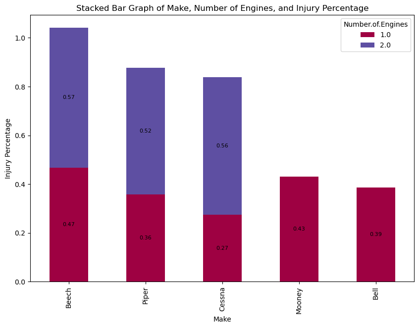
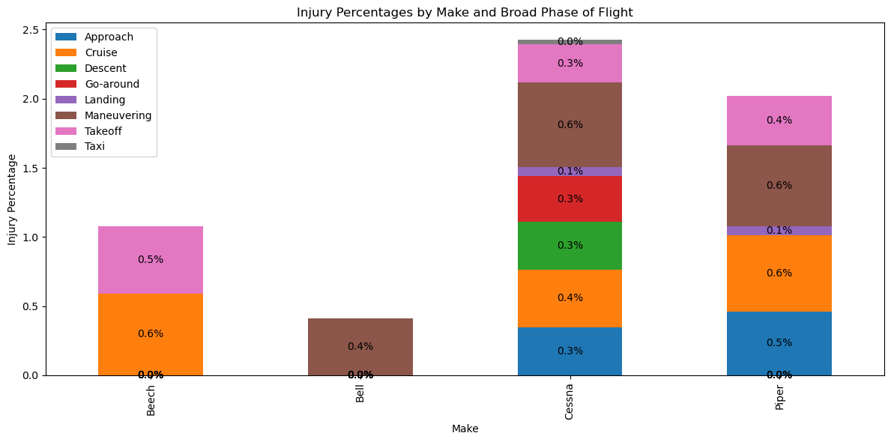
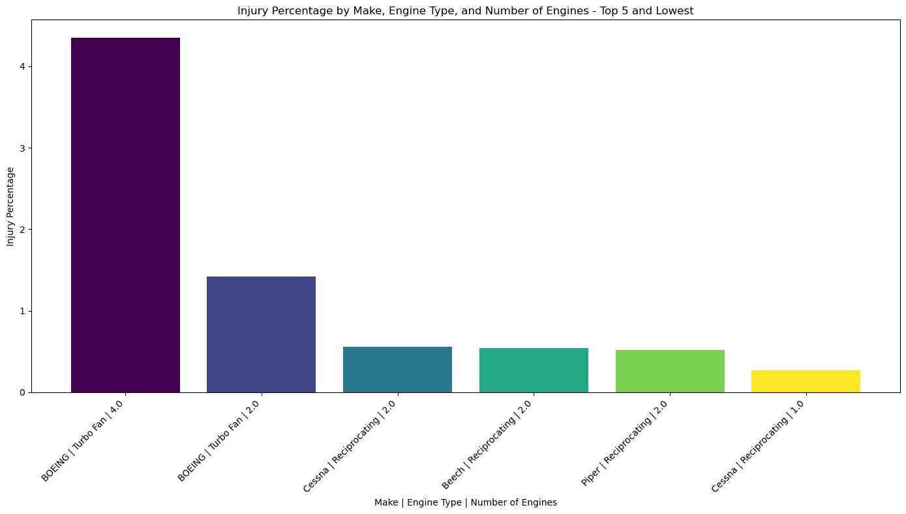

Tableau Dashboard- https://public.tableau.com/app/profile/neal.iyer/viz/Aviation_17084011749550/Dashboard1?publish=yes

### **Introduction**

This project explores the aviation industry as a potential area for expansion and investment by analyzing historical data on aircraft incidents and accidents. 

By examining patterns in the data, the goal is to identify the safest aircraft makes, models, and engine types, as well as the most critical phases of flight in terms of safety.

This analysis will support informed decision-making for purchasing and operating aircraft for commercial and private purposes.

### **Objectives**

-To identify the lowest risk aircraft makes and models based on historical accident and injury data.

-To analyze the phases of flight to determine which are most associated with higher risks of accidents and injuries.

-To provide recommendations on aircraft selection and operational focus areas to minimize safety risks and maximize investment returns in the aviation sector.

### **Data**

The dataset utilized in this project is provided by the National Transportation Safety Board (NTSB), encompassing civil aviation accident and selected incident data from 1962 to 2023. This comprehensive dataset includes detailed information about each event, including but not limited to the aircraft make and model, phase of flight, injury severity, and environmental conditions at the time of the incident.

### **Methods**

The analysis involved several key steps, including:
     
* data cleaning
* exploratory data analysis (EDA)
* statistical analysis. 

 The methodologies applied aimed to uncover patterns and insights through a data-driven approach, employing various statistical tools and visualization techniques to support the findings.

### **Results**

**Safest Aircraft:* The analysis highlighted Cessna (single-engine) and Piper (dual-engine) aircraft as having the lowest percentages of injuries, suggesting they are among the safest choices for investment.

**Critical Phases of Flight:* Cruise, Takeoff, and Maneuvering were identified as most prone to incidents and injuries, emphasizing the importance of focused safety measures and training in these areas.

**Engine Type:* Boeing Turbo Fan 4 and 2 Engine planes appear to be the most unsafe, with the highest injury percentages, while Cessna 1 Engine Reciprocating has the lowest injury percentage and looks to be the safest choice for engine type.

### **Conclusions**

The findings from this analysis offer valuable insights into the aviation industry, particularly in identifying safer aircraft and understanding the dynamics of flight safety. By selecting low-risk aircraft and focusing on critical safety areas, potential investors can strategically minimize risks and capitalize on the opportunities within the aviation sector.

#### Contribution
**This project is a personal academic effort by Neal Iyer. Feedback and contributions are welcome and can be directed to the author through appropriate academic channels.*

